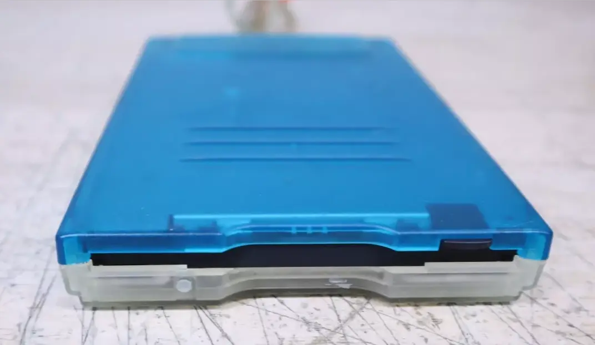
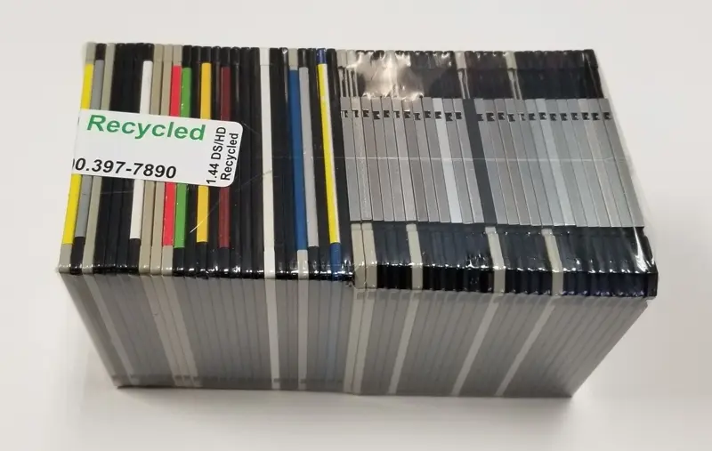
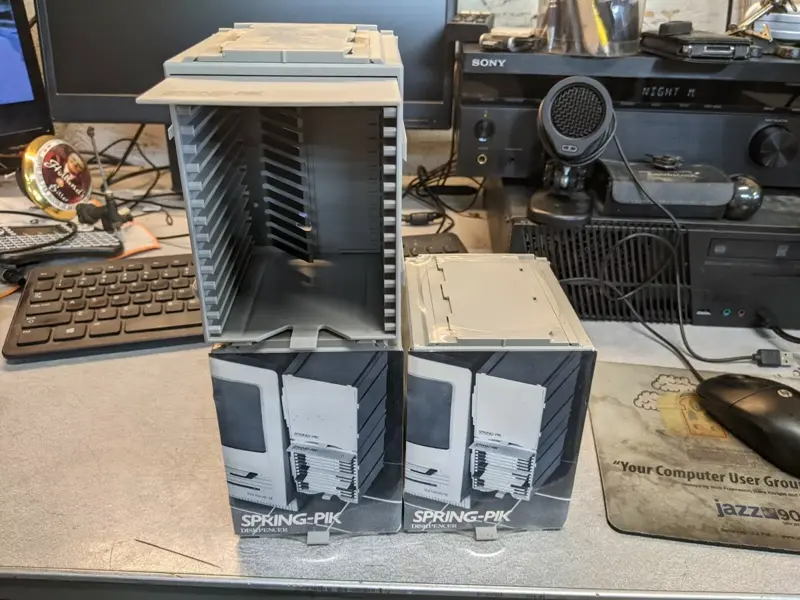

It started with [*Floppy Disk Fever*](https://www.amazon.com/Floppy-Disk-Fever-Afterlives-Flexible/dp/9493148866). A book less about storage capacity and more about cultural density. How diskettes weren't just a medium, but a message. That was the spark. Dare I say, the fever took hold. 😅

And I thought: what if my productivity system had a disk slot?

Not metaphorically. Literally.

## 💾 Inserting the Idea:

I went straight to eBay. After some digging, I found the one: a translucent blue TEAC VST USB floppy drive — the kind that looked like it belonged to an iMac G3 in 1999. Minty, clicky, beautiful.

🛍️ <a href="https://www.ebay.com/itm/376001580068">eBay - TEAC External VST USB Floppy Disk Drive - FD-05PU Blue</a>

Ten disks seemed like enough at first. But the second I saw that stack of mystery floppies in a bulk lot of different colors, stickers, old residue of someone else's data — I knew. Ten disks wasn't a system. Fifty might be. 

🛍️ <a href="https://www.ebay.com/str/tomdotstar">eBay - FloppyDisk.com store</a>

And to top it off, a Spring-Pik floppy organizer with a satisfying, spring-loaded eject mechanism.

🛍️ <a href="https://www.ebay.com/itm/305758610502">eBay - Spring-Pik 3.5 inch floppy disk storage box</a>

So I bought them all. And I decided each one would hold a week of my life.

## 🐙 Enter: Octodo

What I'm building or at least considering building is tentatively called Octodo. It's a wrapper around [todo.txt](https://todotxt.org/) that transforms checking your tasks from a mundane activity into a small ceremony.

The ritual is simple: Insert the disk. Here's what unfolds:

* 🐚 A new terminal window opens
* 🐙 Octodo greets you with ASCII art of an octopus, naturally (many arms === many tasks)
* 🎵 A chiptune startup sound plays — think startup chime meets NES boot
* 📊 Octodo reads the last week's disk and shows stats: tasks done, patterns, streaks
* 💭 A quote appears from a programming legend or a book I love
* 📝 Finally, it prompts: *What's your first task for the week?*

It's part CLI, part altar.

## ⌛ Intentional Limitations

Each disk becomes a container for a week's work—a discrete, physical unit of productivity. When the week is over, I eject the disk, archive it to a labeled box, and start fresh. The ritual matters as much as the data.

What I love about this approach is how it changes my relationship with my tasks. Instead of an endless digital stream, my work becomes tactile, bounded, and complete. The whirr of the drive is a reminder to focus. The click of ejection marks an ending.

It's not about efficiency. It's about intentionality. The constraint isn't technical; it's psychological. And that makes all the difference.

It's not practical by modern standards. But it's **mine**.

## 📦 What's Next

Right now, the plan for Octodo is simply a Bash script. Simple, fast, and perfectly suited to the limitations I've embraced.

But I'm also considering some disk ideas:

* A `guest.dsk` for inviting visitors to leave their mark
* A `focus.dsk` for starting a Pomodoro timer, blocking distractions, and playing lo-fi beats
* A `journal.dsk` for end-of-day reflection, writing directly to magnetic media
* A `gallery.dsk` for housing an ASCII art collection for customizable startup flair
* A `builds.dsk` for creating tiny tools under strict size constraints
* A `zine.dsk` for a digital artifact containing stories, quotes, and code snippets

Each disk a capsule. A vibe. A constraint with a handle.

## 👋 Closing Track

It's a little ridiculous.
It's completely impractical.
It's absolutely mine.

And that's exactly why I'm building it.

Follow along at [mux.sh](https://mux.sh), or better yet, dust off a floppy drive and start your own ritual.
